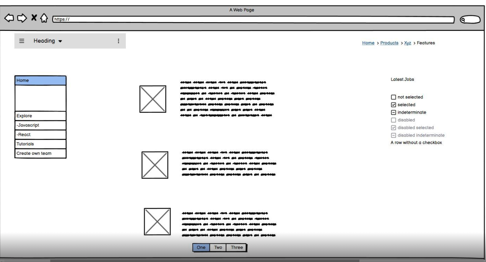

# nextGenCoders

A blog that act as a starting point for beginners who want to dive into the world of web development, as well as getting information about job opportunities in the field. Below is a simple wireframe of the blog.

## User Story
>
> AS A user
>
> I WANT to be able to write and post blog posts on a Blog Website.

## Deployment

The blog was deployed in Netlify and can be accessed "here"

## Usage

## Screenshots

## Tech-Stack
- JavaScript
- Next.js
- Tailwind CSS

## Credits & Resoucres

Here's a list containing all the tutorials and/or references used in the project:
- [Creating a Next.js App](https://nextjs.org/learn/basics/create-nextjs-app)

## Contributors

Thanks to the following people who have contributed to this project:\
[Lilian Ortiz](https://github.com/ortizlilian) \
[Obinna Obianuo](https://github.com/ObianuoObi)\
[Prince Andrews Nimako](https://github.com/nimscodes) \
[Yogita Negi](https://github.com/yogi-88)
